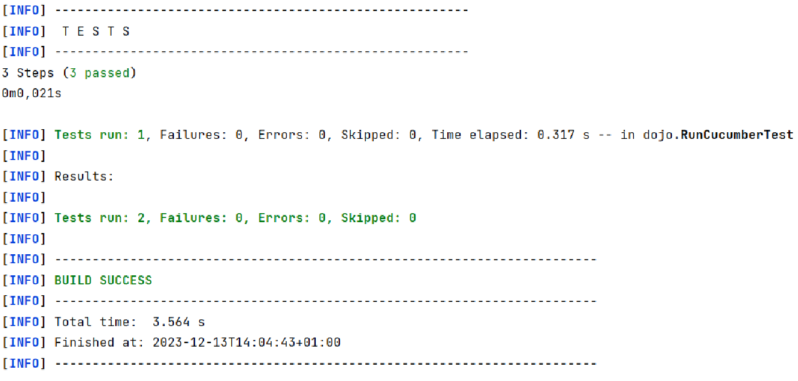

= R5.A.08 -- Dépôt pour les TPs
:icons: font
:MoSCoW: https://fr.wikipedia.org/wiki/M%C3%A9thode_MoSCoW[MoSCoW]

Ce dépôt concerne les rendus de mailto:A_changer@etu.univ-tlse2.fr[Tilian HURÉ].

== TP1

Commande Maven :

[source, bash]
----
mvn archetype:generate "-DarchetypeGroupId=io.cucumber" "-DarchetypeArtifactId=cucumber-archetype" "-DarchetypeVersion=7.14.1" "-DgroupId=hellocucumber" "-DartifactId=hellocucumber" "-Dpackage=hellocucumber" "-Dversion=1.0.0-SNAPSHOT" "-DinteractiveMode=false"
----

Contenu du fichier `is_it_friday_yet.feature`
[source,gherkin]
----
Feature: Est on vendredi ?

#  Scenario: Dimanche n'est pas vendredi
#    Given on est "dimanche"
#    When on demande si on est vendredi
#    Then répondre "Non"
#
#  Scenario: Vendredi est vendredi
#    Given on est "vendredi"
#    When on demande si on est vendredi
#    Then répondre "Oui"

  Scenario Outline: Vendredi est vendredi
    Given on est "<day>"
    When on demande si on est vendredi
    Then répondre "<answer>"

    Examples:
      | day            | answer |
      | vendredi       | Oui    |
      | dimanche       | Non    |
      | anything else! | Non    |
----

Execution des tests :

image::images/tp1_2.png[,450]

== TP2

Commande Maven :

[source, bash]
----
mvn archetype:generate -DgroupId=com.mycompany.app -DartifactId=cucumber_demo -DarchetypeArtifactId=maven-archetype-quickstart -DinteractiveMode=false
----

Contenu du fichier `pom.xml` (sinon ça marche pas) :

[source, xml]
----
<project xmlns="http://maven.apache.org/POM/4.0.0" xmlns:xsi="http://www.w3.org/2001/XMLSchema-instance"
  xsi:schemaLocation="http://maven.apache.org/POM/4.0.0 http://maven.apache.org/maven-v4_0_0.xsd">
  <modelVersion>4.0.0</modelVersion>
  <groupId>com.mycompany.app</groupId>
  <artifactId>cucumber_demo</artifactId>
  <packaging>jar</packaging>
    <dependencies>
        <dependency>
            <groupId>io.cucumber</groupId>
            <artifactId>cucumber-java</artifactId>
            <version>3.0.2</version>
            <scope>test</scope>
        </dependency>
        <dependency>
            <groupId>io.cucumber</groupId>
            <artifactId>cucumber-junit</artifactId>
            <version>3.0.2</version>
            <scope>test</scope>
        </dependency>
        <dependency>
            <groupId>junit</groupId>
            <artifactId>junit</artifactId>
            <version>4.13.1</version>
            <scope>test</scope>
        </dependency>
    </dependencies>
    <version>1.0-SNAPSHOT</version>
  <name>cucumber_demo</name>
  <url>http://maven.apache.org</url>
</project>
----

Contenu du fichier `Order.java` :

[source, java]
----
package dojo;

import java.util.ArrayList;
import java.util.List;

public class Order {

    private String owner = "";
    private String target = "";
    private final List<String> cocktails = new ArrayList<String>();

    public void declareOwner(String owner) {
        this.owner = owner;
    }

    public void declareTarget(String target) {
        this.target = target;
    }

    public void addCocktail(String cocktail) {
        this.cocktails.add(cocktail);
    }

    public void removeCocktail(String cocktail) {
        this.cocktails.remove(cocktail);
    }

    public String getOwner() {
        return this.owner;
    }

    public String getTarget() {
        return this.target;
    }

    public List<String> getCocktails() {
        return this.cocktails;
    }

}
----

Execution des tests :

