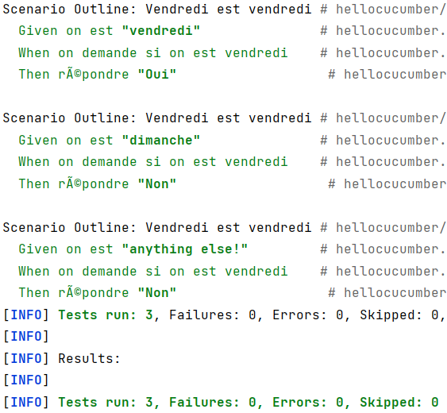
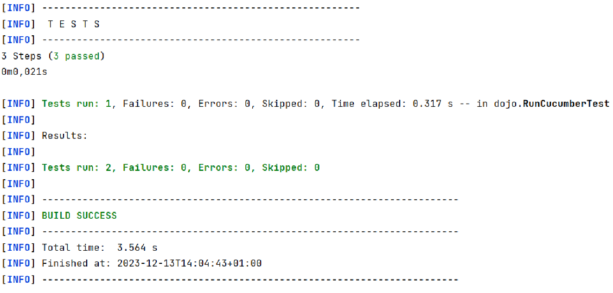
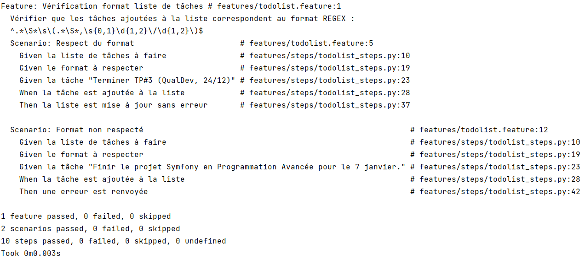

= R5.A.08 -- Dépôt pour les TPs
:icons: font
:MoSCoW: https://fr.wikipedia.org/wiki/M%C3%A9thode_MoSCoW[MoSCoW]
:toc: macro
:toc-title: Sommaire

Ce dépôt concerne les rendus de mailto:A_changer@etu.univ-tlse2.fr[Tilian HURÉ] (groupe 3-2).

toc::[]

== TP1
=== Commande Maven

[source, bash]
----
mvn archetype:generate "-DarchetypeGroupId=io.cucumber" "-DarchetypeArtifactId=cucumber-archetype" "-DarchetypeVersion=7.14.1" "-DgroupId=hellocucumber" "-DartifactId=hellocucumber" "-Dpackage=hellocucumber" "-Dversion=1.0.0-SNAPSHOT" "-DinteractiveMode=false"
----

=== Contenu du fichier `is_it_friday_yet.feature`

[source,gherkin]
----
Feature: Est on vendredi ?

#  Scenario: Dimanche n'est pas vendredi
#    Given on est "dimanche"
#    When on demande si on est vendredi
#    Then répondre "Non"
#
#  Scenario: Vendredi est vendredi
#    Given on est "vendredi"
#    When on demande si on est vendredi
#    Then répondre "Oui"

  Scenario Outline: Vendredi est vendredi
    Given on est "<day>"
    When on demande si on est vendredi
    Then répondre "<answer>"

    Examples:
      | day            | answer |
      | vendredi       | Oui    |
      | dimanche       | Non    |
      | anything else! | Non    |
----

=== Execution des tests

[.thumb]

== TP2

=== Commande Maven

[source, bash]
----
mvn archetype:generate -DgroupId=com.mycompany.app -DartifactId=cucumber_demo -DarchetypeArtifactId=maven-archetype-quickstart -DinteractiveMode=false
----

=== Contenu du fichier `pom.xml`
_(sinon ça marche pas)_

[source, xml]
----
<project xmlns="http://maven.apache.org/POM/4.0.0" xmlns:xsi="http://www.w3.org/2001/XMLSchema-instance"
  xsi:schemaLocation="http://maven.apache.org/POM/4.0.0 http://maven.apache.org/maven-v4_0_0.xsd">
  <modelVersion>4.0.0</modelVersion>
  <groupId>com.mycompany.app</groupId>
  <artifactId>cucumber_demo</artifactId>
  <packaging>jar</packaging>
    <dependencies>
        <dependency>
            <groupId>io.cucumber</groupId>
            <artifactId>cucumber-java</artifactId>
            <version>3.0.2</version>
            <scope>test</scope>
        </dependency>
        <dependency>
            <groupId>io.cucumber</groupId>
            <artifactId>cucumber-junit</artifactId>
            <version>3.0.2</version>
            <scope>test</scope>
        </dependency>
        <dependency>
            <groupId>junit</groupId>
            <artifactId>junit</artifactId>
            <version>4.13.1</version>
            <scope>test</scope>
        </dependency>
    </dependencies>
    <version>1.0-SNAPSHOT</version>
  <name>cucumber_demo</name>
  <url>http://maven.apache.org</url>
</project>
----

=== Contenu du fichier `Order.java`

[source, java]
----
package dojo;

import java.util.ArrayList;
import java.util.List;

public class Order {

    private String owner = "";
    private String target = "";
    private final List<String> cocktails = new ArrayList<String>();

    public void declareOwner(String owner) {
        this.owner = owner;
    }

    public void declareTarget(String target) {
        this.target = target;
    }

    public void addCocktail(String cocktail) {
        this.cocktails.add(cocktail);
    }

    public void removeCocktail(String cocktail) {
        this.cocktails.remove(cocktail);
    }

    public String getOwner() {
        return this.owner;
    }

    public String getTarget() {
        return this.target;
    }

    public List<String> getCocktails() {
        return this.cocktails;
    }

}
----

=== Execution des tests

[.thumb]

== TP#3
J'ai pour habitude de noter dans une note Google Keep le travail que j'ai à faire pour l'IUT sous forme de tâches. Pour chaque tâche, j'essaye de respecter un format bien précis comprenant le travail à faire, le module concerné ainsi que la date limite, afin d'obtenir facilement une vue d'ensemble de ce qu'il me reste à faire.

J'ai donc choisi d'utiliser Python et la librairie `Behave` afin d'implémenter les scénarios vérifiant qu'une tâche ne peut être ajoutée que si elle respecte le format défini. J'ai également implémenté la classe `TodoList` permettant de gérer une liste de tâches en fonction d'un format donné.

=== Contenu du fichier `todolist.feature`

[source, gherkin]
----
Feature: Vérification format liste de tâches
  Vérifier que les tâches ajoutées à la liste correspondent au format REGEX :
    ^.*\S*\s\(.*\S*,\s{0,1}\d{1,2}\/\d{1,2}\)$

  Scenario: Respect du format
    Given la liste de tâches à faire
    Given le format à respecter
    Given la tâche "Terminer TP#3 (QualDev, 24/12)"
    When la tâche est ajoutée à la liste
    Then la liste est mise à jour sans erreur

  Scenario: Format non respecté
    Given la liste de tâches à faire
    Given le format à respecter
    Given la tâche "Finir le projet Symfony en Programmation Avancée pour le 7 janvier."
    When la tâche est ajoutée à la liste
    Then une erreur est renvoyée
----

=== Contenu du fichier `todolist_steps.py`

[source, python]
----
from behave import *
from todolist import TodoList, TaskInvalidFormat

todoList = TodoList
task = ""
taskAdded = False

@given('la liste de tâches à faire')
def setTodoList(context):
    global todoList
    todoList = TodoList([
        'Préparer prés. (MM, 18/12)',
        'RÉVISER contrôle (NewDB, 19/12)',
        'RÉVISER contrôle (Management, 20/12)'
    ])

@given('le format à respecter')
def setTaskFormat(context):
    todoList.setTaskFormat("^.*\S*\s\(.*\S*,\s{0,1}\d{1,2}\/\d{1,2}\)$")

@given('la tâche "{t}"')
def setNewTask(context, t):
    global task
    task = t

@when('la tâche est ajoutée à la liste')
def addNewTask(context):
    global taskAdded
    try:
        todoList.addTask(task)
        taskAdded = True
    except TaskInvalidFormat:
        taskAdded = False

@then('la liste est mise à jour sans erreur')
def checkTodoList(context):
    assert taskAdded
    assert isTaskInTodoList()

@then('une erreur est renvoyée')
def checkError(context):
    assert not taskAdded
    assert not isTaskInTodoList()

def isTaskInTodoList():
    for t in todoList.getTasks():
        if t == task: return True
    return False
----

=== Exécution des tests

[.thumb]
