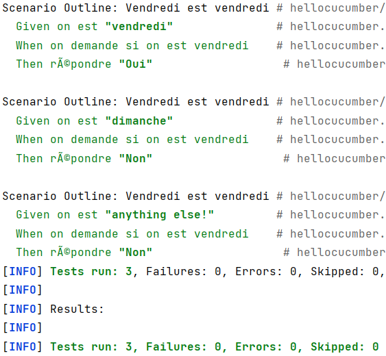

= R5.A.08 -- Dépôt pour les TPs
:icons: font
:MoSCoW: https://fr.wikipedia.org/wiki/M%C3%A9thode_MoSCoW[MoSCoW]

Ce dépôt concerne les rendus de mailto:A_changer@etu.univ-tlse2.fr[Tilian HURÉ].

== TP1

Commande Maven :

[source, bash]
----
mvn archetype:generate "-DarchetypeGroupId=io.cucumber" "-DarchetypeArtifactId=cucumber-archetype" "-DarchetypeVersion=7.14.1" "-DgroupId=hellocucumber" "-DartifactId=hellocucumber" "-Dpackage=hellocucumber" "-Dversion=1.0.0-SNAPSHOT" "-DinteractiveMode=false"
----

Contenu du fichier `is_it_friday_yet.feature`
[source,gherkin]
----
Feature: Est on vendredi ?

#  Scenario: Dimanche n'est pas vendredi
#    Given on est "dimanche"
#    When on demande si on est vendredi
#    Then répondre "Non"
#
#  Scenario: Vendredi est vendredi
#    Given on est "vendredi"
#    When on demande si on est vendredi
#    Then répondre "Oui"

  Scenario Outline: Vendredi est vendredi
    Given on est "<day>"
    When on demande si on est vendredi
    Then répondre "<answer>"

    Examples:
      | day            | answer |
      | vendredi       | Oui    |
      | dimanche       | Non    |
      | anything else! | Non    |
----

== TP2...
